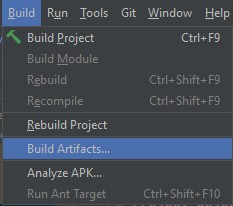
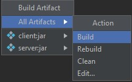
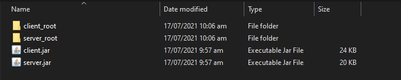
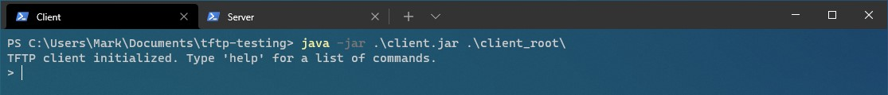
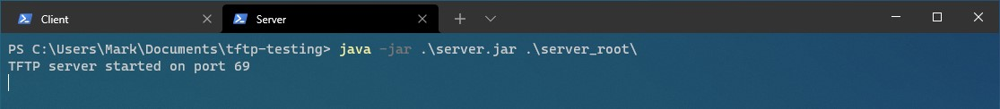
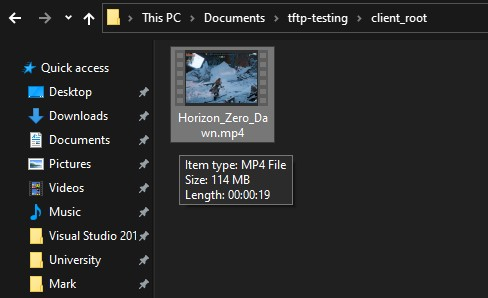
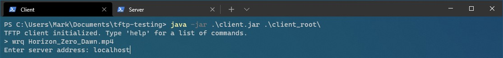
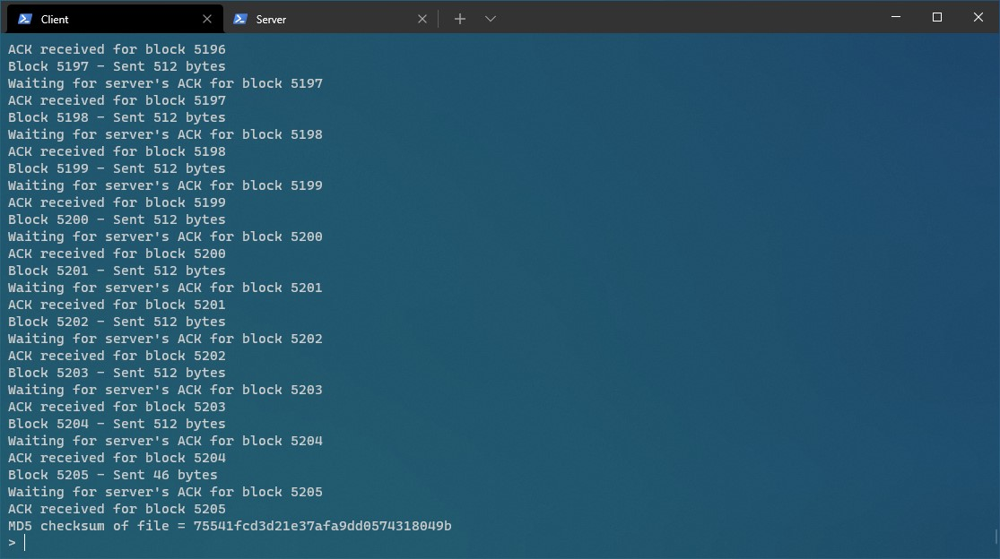
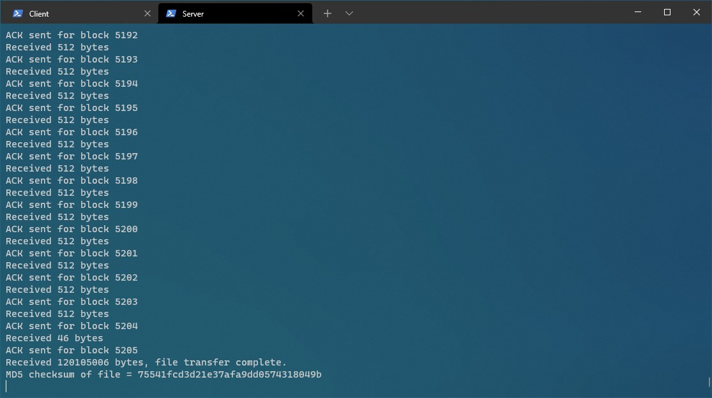
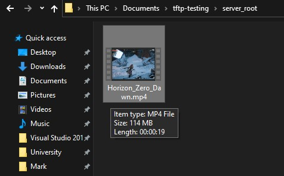

# tftp
My attempt at implementing the TFTP protocol in Java.  
Click [here](https://datatracker.ietf.org/doc/html/rfc1350 "TFTP specification") to view the TFTP protocol specification

# Project Objective
The objective of this project was to mainly practice my Java programming skills and get more familiar with network programming.

# Project Structure
This project consists of 3 modules - `client`, `server`, and `shared`. I use JetBrains IntelliJ IDEA for my development.

## Client
The `client` module is an implementation of a TFTP client. Users can use the `rrq` (read-request) or `wrq` (write-request) commands to read/write files from/to the TFTP server.

## Server
The `server` module is an implementation of a TFTP server. It supports file reading/writing, as well as error handling.

## Shared
This module contains code used across both the client and server modules, such as packet types, constants, etc...

# Running the project

### Prerequisites

- An installation of IntelliJ IDEA
- Java JDK 15

## Step 1
Clone the repo onto your system into a location of your choice

## Step 2
Open the project in IntelliJ IDEA

## Step 3
At the top on the toolbar, click `Build` and then click `Build Artifacts...`  

A menu should pop up; hover over `All Artifacts`, and click `Build`  

The final JAR files should now be in `tftp/bin/`.

## Step 4

*(Optional): Copy the two JAR files somewhere else onto your disk if you want*

In the directory of the two JAR files, create a root file folder for the client and server. In my example below, I named my root directories `client_root` and `server_root`:

## Step 5
Open two terminal windows for the client and server, navigate to the directory where the two JAR files reside and run:

- `java -jar client.jar <name_of_client_root>`
- `java -jar server.jar <name_of_server_root>`

If everything succeeds, you should see the following:

**Client terminal**

**Server terminal**

## Step 6
You should now have a running TFTP client/server on your system. To test it out, add files into the client/server root directories and run the RRQ/WRQ commands.

### Example
I have a 114 MB video in the client root directory which I want to send

To send it, I execute `wrq Horizon_Zero_Dawn.mp4` on the client terminal

The file transfer is successful, we can view the MD5 checksums on the client/server side to ensure data integrity:

**Client MD5**

**Server MD5**

The video has successfully arrived in the server's root directory :)
